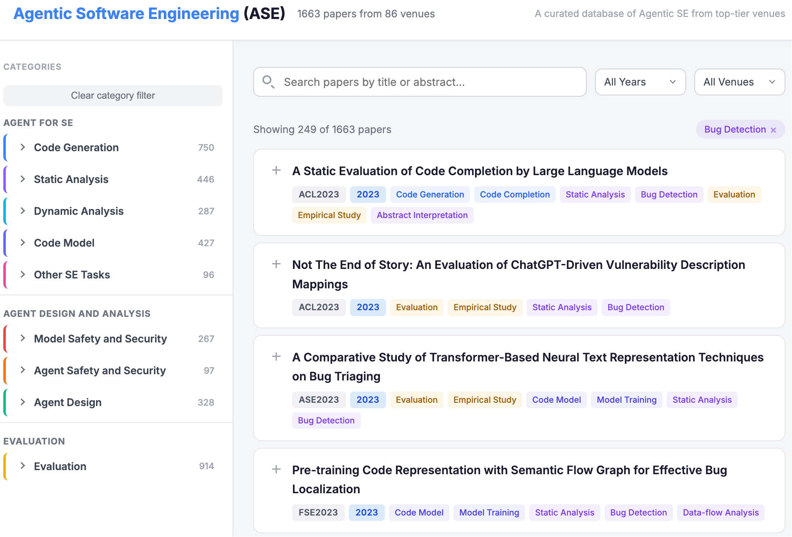

# Agentic Software Engineering (ASE) <a href="https://github.com/PurCL/ASE"></a>

A curated literature database of **1,663** research papers on Agentic Software Engineering, drawn from top-tier venues in Software Engineering, Programming Languages, Security, and NLP. This repository also provides an **automated paper-labeling skill** — a Claude Code pipeline that extracts, filters, and classifies new papers from raw proceedings files in various formats (e.g., bib and html), keeping the database up to date with minimal manual effort.

## Table of Contents

- [Browse the Website](#browse-the-website)
- [Tracked Venues](#tracked-venues)
- [Taxonomy](#taxonomy)
- [Paper Selection](#paper-selection)
- [Adding New Papers](#adding-new-papers)
- [Contributing](#contributing)
- [Extending the Taxonomy](#extending-the-taxonomy)
- [Disclaimer and Contact](#disclaimer-and-contact)

---

## Browse the Website

Open `web/index.html` locally or [browse online](https://chengpeng-wang.github.io/Survey/ase.html). The interface supports:

- **Full-text search** across titles and abstracts
- **Year and venue filters** — independent single-select dropdowns; venue names are normalized (e.g., "ICSE" matches all ICSE years)
- **Label filter** — select one or more research topics from the sidebar or by clicking label pills on paper cards; multiple labels combine with AND logic
- **Expandable abstracts** — click any paper card to reveal its abstract
- **Active filter summary** — each active constraint is shown as a removable tag below the toolbar

All filter dimensions (year, venue, labels) are optional and combine with AND logic: only papers satisfying every active constraint are shown.



---

## Tracked Venues

Papers are **systematically** collected for all proceedings from **2023–2026** that have been publicly released. The database additionally includes selected papers from earlier years (2020–2022) and other venues on a best-effort basis.

Tracked venues:

**Software Engineering (SE)**
- ICSE (2023--2025), FSE (2023--2025), ASE (2023--2025), ISSTA (2022--2025)
- TSE (2023--2024), TOSEM (2023--2024)

**Programming Languages (PL)**
- PLDI (2023, 2025), OOPSLA (2023--2025), POPL (2025), CC (2025), COLM (2025)

**Security**
- S&P (2023--2025), USENIX Security (2023--2025), CCS (2023--2025), NDSS (2024--2026)
- RAID (2023)

**Natural Language Processing (NLP)**
- ACL (2023--2025), EMNLP (2020, 2023--2025), NAACL (2024--2025)

**Machine Learning (ML)**
- ICML (2021, 2023--2025), NeurIPS (2022--2024), ICLR (2021, 2023--2025)

### Paper Counts by Venue (2023–2026)

> Each `█` block represents ~9 papers. Bars are scaled within each track independently.

#### 🔧 Software Engineering

| Venue | 2023 | 2024 | 2025 | Total |
|:------|:-----|:-----|:-----|------:|
| ICSE  | `███░░░░░░░░░░░░░░░░░`&nbsp;23 | `██████░░░░░░░░░░░░░░`&nbsp;53 | `██████████░░░░░░░░░░`&nbsp;90 | **166** |
| FSE   | `███░░░░░░░░░░░░░░░░░`&nbsp;31 | `█████░░░░░░░░░░░░░░░`&nbsp;45 | `██████░░░░░░░░░░░░░░`&nbsp;54 | **130** |
| ASE   | `████░░░░░░░░░░░░░░░░`&nbsp;36 | `█████████░░░░░░░░░░░`&nbsp;78 | `████████████████████`&nbsp;178 | **292** |
| ISSTA | `█░░░░░░░░░░░░░░░░░░░`&nbsp;10 | `█████░░░░░░░░░░░░░░░`&nbsp;45 | `█████░░░░░░░░░░░░░░░`&nbsp;43 | **98** |
| **Total** | **100** | **221** | **365** | **686** |

#### 🔬 Programming Languages

| Venue | 2023 | 2024 | 2025 | Total |
|:------|:-----|:-----|:-----|------:|
| PLDI   | `██░░░░░░░░░░░░░░░░░░`&nbsp;2 | `░░░░░░░░░░░░░░░░░░░░`&nbsp;0 | `████░░░░░░░░░░░░░░░░`&nbsp;4 | **6** |
| OOPSLA | `████░░░░░░░░░░░░░░░░`&nbsp;4 | `█████████████░░░░░░░`&nbsp;13 | `█████████████████░░░`&nbsp;17 | **34** |
| POPL   | `░░░░░░░░░░░░░░░░░░░░`&nbsp;0 | `░░░░░░░░░░░░░░░░░░░░`&nbsp;0 | `█░░░░░░░░░░░░░░░░░░░`&nbsp;1 | **1** |
| **Total** | **6** | **13** | **22** | **41** |

#### 🔒 Security

| Venue | 2023 | 2024 | 2025 | 2026 | Total |
|:------|:-----|:-----|:-----|:-----|------:|
| CCS        | `██░░░░░░░░░░░░░░░░░░`&nbsp;4 | `██████████████░░░░░░`&nbsp;24 | `███████████░░░░░░░░░`&nbsp;19 | — | **47** |
| USENIXSec  | `██░░░░░░░░░░░░░░░░░░`&nbsp;3 | `█████████░░░░░░░░░░░`&nbsp;16 | `█████████████░░░░░░░`&nbsp;22 | — | **41** |
| S&P        | `█░░░░░░░░░░░░░░░░░░░`&nbsp;1 | `█████░░░░░░░░░░░░░░░`&nbsp;9 | `███████░░░░░░░░░░░░░`&nbsp;12 | — | **22** |
| NDSS       | — | `██░░░░░░░░░░░░░░░░░░`&nbsp;3 | `████████████░░░░░░░░`&nbsp;21 | `██████████████████░░`&nbsp;31 | **55** |
| **Total** | **8** | **52** | **74** | **31** | **165** |

#### 💬 Natural Language Processing

| Venue | 2023 | 2024 | 2025 | Total |
|:------|:-----|:-----|:-----|------:|
| ACL   | `██░░░░░░░░░░░░░░░░░░`&nbsp;23 | `████████░░░░░░░░░░░░`&nbsp;79 | `███████████████████░`&nbsp;192 | **294** |
| EMNLP | `████░░░░░░░░░░░░░░░░`&nbsp;39 | `██████░░░░░░░░░░░░░░`&nbsp;59 | `███████████████░░░░░`&nbsp;152 | **250** |
| NAACL | `░░░░░░░░░░░░░░░░░░░░`&nbsp;0 | `█░░░░░░░░░░░░░░░░░░░`&nbsp;6 | `██░░░░░░░░░░░░░░░░░░`&nbsp;16 | **22** |
| **Total** | **62** | **144** | **360** | **566** |

---

## Taxonomy

Papers are classified using a two-level taxonomy with 9 top-level categories and 47 sub-categories. A paper may carry multiple labels. The taxonomy is organized into three super-groups:

### Agent for SE

Papers where LLMs or AI agents are applied to core software engineering tasks.

| Category | Sub-Categories | Papers |
|----------|---------------|--------|
| **Code Generation** | Program Synthesis (410), Code Completion (68), Program Repair (223), Code Translation (69), Decompilation (23), Refactoring (37) | 750 |
| **Static Analysis** | Bug Detection (249), Program Verification (44), Specification Inference (33), Type Inference (18), Data-flow Analysis (23), Taint Analysis (16), Code Summarization (67), Code Search (51), Clone Detection (21), Call Graph Analysis (8), Symbolic Execution (7), Pointer Analysis (3), Abstract Interpretation (3) | 446 |
| **Dynamic Analysis** | Test Case Generation (118), Fuzzing (58), Domain-Specific Testing (56), Debugging (40), PoC and Exploit Generation (23), Test Oracle (19), Bug Reproduction (19), Mutation Testing (6) | 287 |
| **Code Model** | Model Training (407), Binary and IR Model (35) | 427 |
| **Other SE Tasks** | Doc/Comment/Commit Message Generation (35), Log Analysis (34), Code Review (29) | 96 |

### Agent Design and Analysis

Research on agent architectures and the safety and security properties of code-oriented LLMs.

| Category | Sub-Categories | Papers |
|----------|---------------|--------|
| **Agent Design** | Planning (206), Tool Use (156), Multi-Agent (96), Memory Management (30) | 328 |
| **Model Safety and Security** | Adversarial Attack (85), Jailbreaking (66), Secure Code Generation (65), Memorization (40), Backdoor Detection (36), Watermarking (35) | 267 |
| **Agent Safety and Security** | Prompt Injection (73), Agent Defense (36), Access Control (12) | 97 |

### Evaluation

Benchmarks, empirical studies, and surveys that assess LLM/agent capabilities for code.

| Category | Sub-Categories | Papers |
|----------|---------------|--------|
| **Evaluation** | Empirical Study (620), Benchmark (392), Survey (26) | 914 |

---

## Paper Selection

Each venue's proceedings are processed through a four-stage pipeline:

1. **Extract** — parse titles and abstracts from BibTeX or HTML files.
2. **Filter** — retain papers whose title or abstract contains both LLM-related terms (e.g., "large language model", "GPT", "agent") and code-related terms (e.g., "program", "software", "testing", "verification"). This keyword pass is deliberately permissive (high recall).
3. **Classify** — pass each candidate to the Claude API, which verifies relevance and assigns taxonomy labels. A paper is included only if LLMs or AI agents constitute a **central contribution**, not merely a baseline or comparison point.
4. **Merge** — add the classified papers to the canonical database (`data/labeldata/labeldata.json`) and regenerate the website.

---

## Adding New Papers

This repository ships a **paper-labeler skill** that automates the full pipeline: extract → filter → label → merge → rebuild. All scripts live in `.claude/skills/paper-labeler/scripts/`.

### Prerequisites

```bash
pip install boto3 requests   # boto3 for Claude API via AWS Bedrock; requests for NDSS scraping
```

AWS credentials must be configured (`~/.aws/credentials`, environment variables, or IAM role) for the labeling step. The filter-only step needs no credentials.

### Option A — Batch mode (recommended)

Scans a rawdata folder, skips venues already recorded in `data/venues.json`, runs the full pipeline for each new venue, and rebuilds the website.

```bash
# Preview what would be processed
python .claude/skills/paper-labeler/scripts/process_folder.py --dry-run

# Process all new venues under data/rawdata/
python .claude/skills/paper-labeler/scripts/process_folder.py

# Process a specific year only
python .claude/skills/paper-labeler/scripts/process_folder.py data/rawdata/2025/

# Keyword filter only — no API calls, no merge (useful for a quick check)
python .claude/skills/paper-labeler/scripts/process_folder.py --filter-only
```

Key options: `--model MODEL`, `--region REGION`, `--delay SECONDS`, `--no-rebuild`.

### Option B — Manual per-venue pipeline

Use when finer control over individual steps is required.

#### Step 1 — Extract papers

```bash
# BibTeX (most venues: ASE, ICSE, FSE, CCS, S&P, OOPSLA, …)
python .claude/skills/paper-labeler/scripts/extract_papers.py \
    data/rawdata/2025/ASE2025.bib > /tmp/extracted.json

# ACL Anthology HTML (ACL, EMNLP, NAACL)
python .claude/skills/paper-labeler/scripts/extract_papers.py \
    data/rawdata/2025/ACL2025.html > /tmp/extracted.json

# NDSS HTML — titles only; fetch abstracts separately
python .claude/skills/paper-labeler/scripts/extract_papers.py \
    data/rawdata/2025/NDSS2025.html > /tmp/ndss_raw.json
python .claude/skills/paper-labeler/scripts/fetch_ndss_abstracts.py \
    /tmp/ndss_raw.json -o /tmp/extracted.json
```

#### Step 2 — Filter and label

```bash
# Keyword filter only (no AWS credentials needed)
python .claude/skills/paper-labeler/scripts/label_papers.py \
    /tmp/extracted.json --phase filter -o /tmp/filtered.json

# Claude labeling only (requires AWS credentials)
python .claude/skills/paper-labeler/scripts/label_papers.py \
    /tmp/filtered.json --phase label -o /tmp/labeled.json

# Both phases in one go
python .claude/skills/paper-labeler/scripts/label_papers.py \
    /tmp/extracted.json --phase all -o /tmp/labeled.json
```

#### Step 3 — Merge into the database

```bash
# Preview first (no writes)
python .claude/skills/paper-labeler/scripts/merge_labeldata.py \
    /tmp/labeled.json --dry-run

# Merge
python .claude/skills/paper-labeler/scripts/merge_labeldata.py \
    /tmp/labeled.json
```

#### Step 4 — Rebuild the website

```bash
python .claude/skills/paper-labeler/scripts/build_site.py
# Output: web/index.html
```

### Using the skill via Claude Code

With [Claude Code](https://claude.ai/code), the pipeline can be invoked conversationally — no need to remember script names or flags:

> "Process the ASE2025 rawdata"  
> "Label the papers in data/rawdata/2025/CCS2025.bib"  
> "Process the entire 2025 folder"  
> "Run a dry-run for all unprocessed venues"  
> "Rebuild the website"

Claude Code will invoke the paper-labeler skill and run the appropriate commands automatically.

### Supported input formats

| Format | Extension | Example venues | Abstracts |
|--------|-----------|----------------|-----------|
| BibTeX | `.bib` | ASE, ICSE, FSE, ISSTA, CCS, S&P, OOPSLA, PLDI, TOSEM, TSE, USENIXSec, NAACL | Inline |
| ACL Anthology HTML | `.html` | ACL, EMNLP, NAACL (some years) | Inline |
| NDSS HTML | `.html` | NDSS | Scraped separately |

### Script reference

| Script | Purpose |
|--------|---------|
| `process_folder.py` | Batch mode — scan folder, skip processed venues, run full pipeline |
| `extract_papers.py` | Step 1 — parse `.bib`/`.html` into uniform JSON |
| `fetch_ndss_abstracts.py` | Step 1b — scrape abstracts from NDSS paper pages |
| `label_papers.py` | Step 2 — keyword filter + Claude API labeling |
| `merge_labeldata.py` | Step 3 — merge labeled JSON into `labeldata.json` |
| `build_site.py` | Step 4 — regenerate `web/index.html` from `labeldata.json` |
| `import_original.py` | One-time import of legacy papers from `original.json` |

Full documentation: `.claude/skills/paper-labeler/USAGE.md`

---

## Contributing

### Add individual papers

1. Append an entry to `data/labeldata/labeldata.json`:
   ```json
   {
     "Paper Title": {
       "type": "INPROCEEDINGS",
       "author": "...",
       "title": "...",
       "booktitle": "...",
       "year": "2025",
       "abstract": "...",
       "url": "https://doi.org/...",
       "venue": "ICSE2025",
       "labels": ["Static Analysis", "Bug Detection"]
     }
   }
   ```
2. Labels must be drawn from the [taxonomy](#taxonomy) above.
3. Rebuild the website: `python .claude/skills/paper-labeler/scripts/build_site.py`.
4. Open a pull request.

### Add a new venue

1. Place the `.bib` or `.html` proceedings file under `data/rawdata/<year>/`.
2. Run the batch pipeline:
   ```bash
   python .claude/skills/paper-labeler/scripts/process_folder.py
   ```
3. Open a pull request containing the rawdata file and updated `labeldata.json`.

### Report missing papers

If a tracked venue's proceedings have been published but are not yet reflected in the database, please [open an issue](https://github.com/PurCL/ASE/issues) with the venue name and a link to the proceedings. You may also suggest specific papers with labels.

---

## Extending the Taxonomy

The pipeline is fully configurable. To track a **different research topic** across the same venues, edit two sections in `.claude/skills/paper-labeler/SKILL.md`:

- **`## Relevance Criteria`** — keyword lists and the natural-language prompt used by Claude to decide whether a paper is relevant. For example, to track LLM-for-theorem-proving, add proof-related keywords and update the relevance description.

- **`## Label Taxonomy`** — the two-level category hierarchy. Add, remove, or rename categories as needed. After editing, keep the `TAXONOMY` dict in `build_site.py` and `label_papers.py` in sync.

Re-run the pipeline on existing rawdata to reclassify papers under the updated taxonomy:

```bash
# Re-label a single extracted file
python .claude/skills/paper-labeler/scripts/label_papers.py \
    /tmp/extracted.json --phase all -o /tmp/relabeled.json

# Or reprocess all rawdata from scratch
python .claude/skills/paper-labeler/scripts/process_folder.py
```

---

## Disclaimer and Contact

This repository is intended solely for research purposes. All metadata is sourced from publicly available proceedings pages on ACM, IEEE, and corresponding conference websites. Full-text PDFs are not included or redistributed.

For questions or suggestions, please reach out via [stephenw.wangcp@gmail.com](mailto:stephenw.wangcp@gmail.com) or [wang6590@purdue.edu](mailto:wang6590@purdue.edu).
